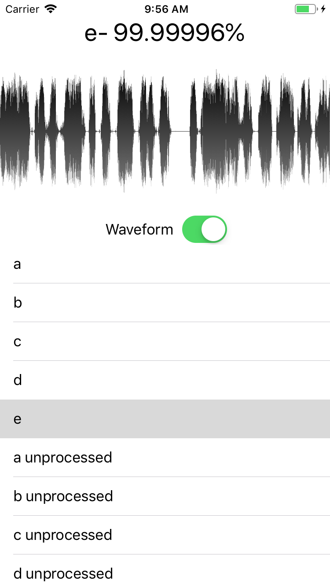

# RoboSurfer

An image classifier based on waveforms and spectrograms of Robocall audio. Built with Core ML and trained with Create ML.

<div align = "center">

</div>

## Training
The classifier model was trained with waveforms generated from the app itself and spectrograms created with [Spek](http://spek.cc). Training for a new model can be setup with Create ML and Swift Playgrounds in a few lines of code.

## Usage
If the app is in waveform mode a Core ML image analysis request will return classification results based on waveform images that are generated by the app. 
```swift
if let audioURL = audioURL {
	let waveform = Waveform(audioAssetURL: audioURL)!
	let configuration = WaveformConfiguration(size: CGSize(width: 1000, height: 500),
                                                          color: UIColor.black,
                                                          style: .gradient,
                                                          position: .middle)
                
  let image = UIImage(waveform: waveform, configuration: configuration)
		DispatchQueue.main.async {
			self.waveformImage.image = image
//     UIImageWriteToSavedPhotosAlbum(image!, nil, nil, nil)
			self.classify(image: image!)
		}
}
```

If the app is in spectrogram mode classification results are returned based on an included spectrogram image.

```swift
let model = try VNCoreMLModel(for: self.waveformMode ? ImageClassifier().model : SpeClassifier().model)
                    
let request = VNCoreMLRequest(model: model, completionHandler: { [weak self] request, error in
	DispatchQueue.main.async {
		if let results = request.results {
			let classifications = results as! [VNClassificationObservation]
			print(classifications)
			if classifications.isEmpty {
				self?.classificationLabel.text = "No matching robocall"
			} else {
				let classification = classifications.first
				let confidence = classification!.confidence * 100
				self?.classificationLabel.text = "\(classification!.identifier)- \(confidence)%"
			}
		}
	}
})
                    
try handler.perform([request])
```
